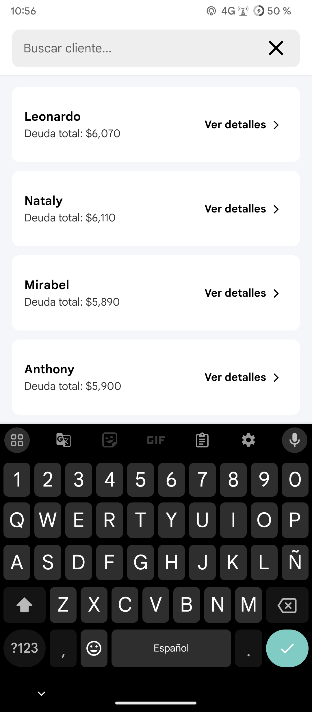
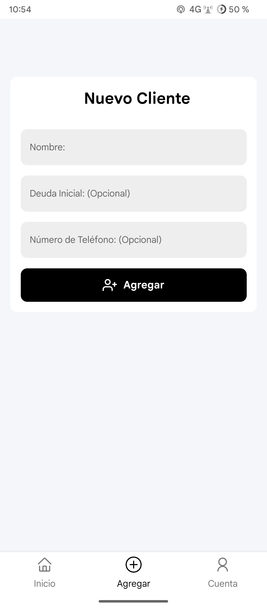
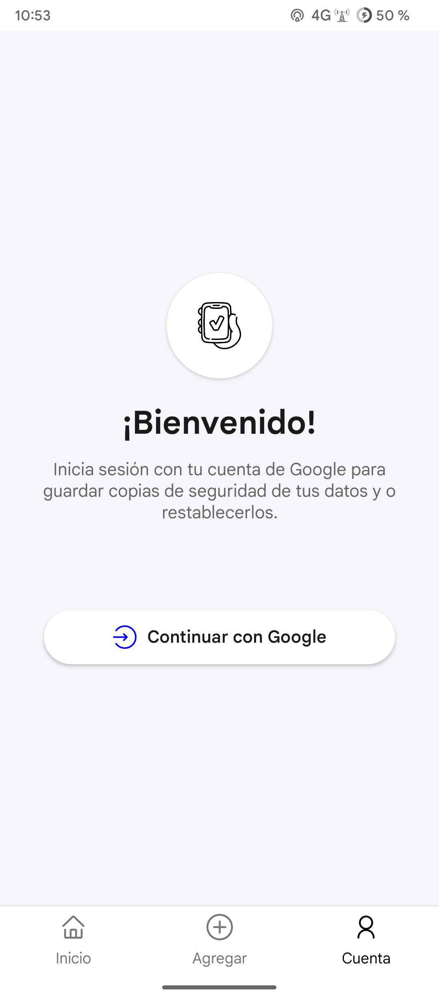
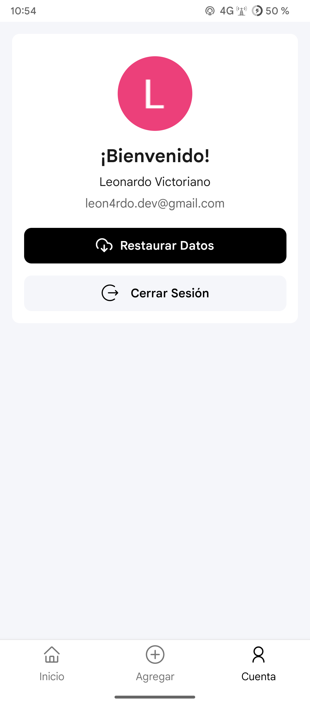
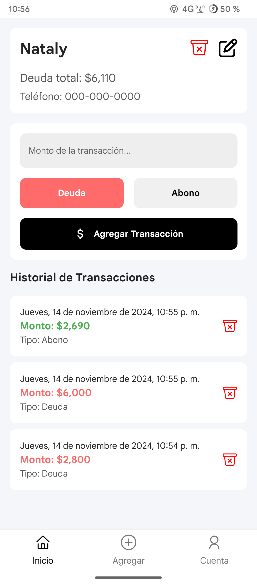

# Colmado Gutierrez - Aplicación de Seguimiento de Deudas 

## Descripción

Colmado Gutierrez es una simple app que hice en React Native para ayudar a pequeños negocios, cm por ejemplo colmados, tienditas o cualquier negocio que le fié a muchos clientes, sirve gestionar eficientemente las deudas de los malapagas. Esta aplicación permite a los dueños de tiendas agregar clientes, realizar un seguimiento de sus deudas, registrar transacciones y ver historiales detallados de transacciones, tmb se puede vincular una cuenta de google para guardar copias de seguridad automaticas en google drive.

Es la primera app que desarrollo desde 0, sé que me falta mucho por aprender y dejando de lado la mierda de codigo que verás aquí JAJAJAJA, fue una experiencia muy buena dondé aprendi muchas cosas y me jodí la cabeza intentado hacer otras otras xd.

## Características

- Agregar nuevos clientes con deuda inicial (opcional) y número de teléfono (opcional)
- Ver una lista de clientes ordenada por monto de deuda
- Buscar clientes por nombre
- Agregar transacciones de deuda o abono para cada cliente
- Ver historial detallado de transacciones para cada cliente: dia, mes año y hora
- Mostrar deuda total y número de clientes con deuda
- Almacenamiento persistente de datos usando AsyncStorage
- Copia de seguridad automatica de los datos en Google Drive
- Editar o eliminar clientes
- Eliminar transacciones
- Interfaz intuitiva y facil de usar

## Tecnologías Utilizadas

- React Native
- Expo
- React Navigation
- AsyncStorage para persistencia local de datos
- Context API para gestión de estado
- Otras ahí pues q paja documentar

## Instalación

1. Clonar el repositorio:
   ```
   git clone https://github.com/leon4rdo-sh/gestor-de-deudas-react-native
   ```

2. Navegar al directorio del proyecto (q hdp nombre más largo):
   ```
   cd gestor-de-deudas-react-native
   ```

3. Instalar dependencias:
   ```
   npm install
   ```

4. Iniciar el servidor de desarrollo de Expo:
   ```
   npm start
   ```

5. Usar la app Expo Go en tu cel para escanear el código QR y ejecutar la app o usa un emulador, aunque la verdad mejor haz una build de desarrollo porque Expo Go es alta kk.


## Uso

1. **Pantalla de Inicio**: Ver todos los clientes con deuda, buscar clientes y ver un resumen de la deuda total.

2. **Agregar Cliente**: Hacer clic en el botón "Agregar" para agregar un nuevo cliente con su nombre, deuda inicial y número de teléfono.

3. **Detalles del Cliente**: Tocar una tarjeta de cliente para ver su historial de transacciones y agregar nuevas transacciones (deudas o pagos) tmb puedes eliminar transacciones, editar la info de el cliente o eliminarlo.

## Imágenes de la app pues

1. Pantalla principal


2. Pantalla para buscar clientes



3. Pantalla para agregar clientes



4. Pantalla de login con google



5. Pantalla del usuario



6. Pantalla de los clientes



# Si bueno a dormir